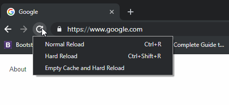

# Example of Markdown Document

Comprehensive example document about what could be done here

## Guide to do X thing!

### Step 1: Do something
1. Click on a button!
2. type out something!
3. Choose an option from a dropdown menu!

### Step 2: A big step
Enter the following information:
- **Sender Information**: Name, address, contact details
- **Recipient Information**: Delivery address and contact
- **Package Details**: Weight, dimensions, special instructions
- **Service Type**: Standard, express, or priority delivery

### Step 3: Use emojis!
Inform the user to be careful when doing this step:
- ✅ Something the user should do
- ❌ Something the user should avoid

### Step 4: Include Images!
Show the user where!

<!-- TODO: Show gifs
### Step 5: Gifs!
Show the user how!

-->

## Tables

Easy comparison for the user

| Plans | Benefit 1 | Benefit 2 | Benefit 3 |
|--------|----|----|----|
| Plan 1 | ✅ | ✅ | ❌ |
| Plan 2 | ❌ | ✅ | ❌ |
| Plan 3 | ❌ | ❌ | ✅ |

## Hypertext Links!

For more help, [contact our support team.](https://nearfleet.com)
